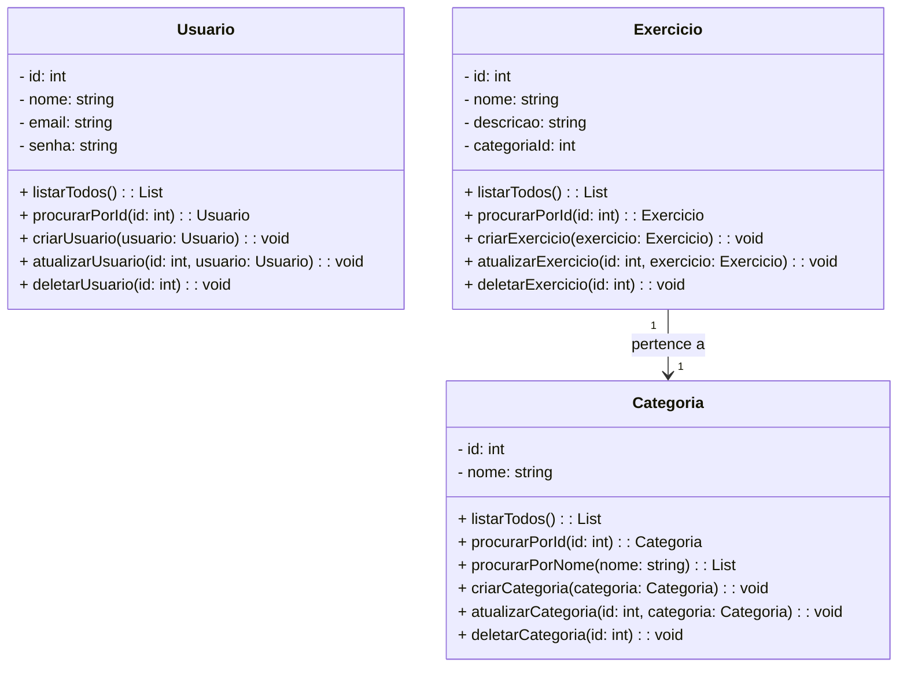

<<<<<<< HEAD

# FitJourney - API de Gestão de Atividades Físicas 🏋️‍♂️🏃‍♀️

## A API FitJourney é um sistema completo para gerenciamento de atividades físicas, desenvolvido com TypeScript, NestJS e TypeORM. Ela permite o cadastro e gerenciamento de usuários, te ajuda a alcançar seus objetivos de forma eficiente. Cadastre seus treinos, acompanhe seu progresso, calcule seu IMC e muito mais!

## 1. Descrição 📋

Esta API foi criada para atender à necessidade de gerenciamento de usuários e atividades físicas. Através dela, é possível gerenciar usuários registrados, seus exercícios e a organização dos mesmos por categorias. Ela foi desenvolvida com boas práticas de programação e arquitetura para garantir que seja escalável, segura e de fácil manutenção.

### 1.1 Principais Funcionalidades 🚀

1. **Cadastro de Usuários** 👤
   Cria um perfil personalizado, incluindo informações como altura, peso e objetivos de treino. Com base nesses dados, o sistema calcula seu IMC e sugere planos de treino adequados ao seu perfil.

2. **Cadastro de Exercícios** 🏋️‍♂️
   Possibilita o registro de exercícios físicos, detalhando informações como nome, descrição, séries e repetições, para um controle eficaz do treinamento.

3. **Categorias de Exercícios** 📂
   Organiza os exercícios em categorias, facilitando a busca e a utilização durante os treinos, como "Cardio", "Musculação", "Flexibilidade", etc.

4. **Consulta de Dados** 🔍
   Permite consultas detalhadas sobre usuários, exercícios e categorias com base em diferentes parâmetros de filtragem, otimizando a busca e visualização de dados.

5. **Edição e Atualização de Dados** ✏️
   Permite a atualização das informações de usuários, exercícios e categorias, garantindo que os dados estejam sempre atualizados.

---

## 2. Diagrama de Classes 📊

---

## 3. Tecnologias utilizadas

| Item                          | Descrição  |
| ----------------------------- | ---------- |
| **Servidor**                  | Node JS    |
| **Linguagem de programação**  | TypeScript |
| **Framework**                 | Nest JS    |
| **ORM**                       | TypeORM    |
| **Banco de dados Relacional** | MySQL      |

---

## 4. Configuração e Execução

1. Clone o repositório
2. Instale as dependências: `npm install`
3. Configure o banco de dados no arquivo `app.module.ts`
4. Execute a aplicação: `npm run start:dev`
